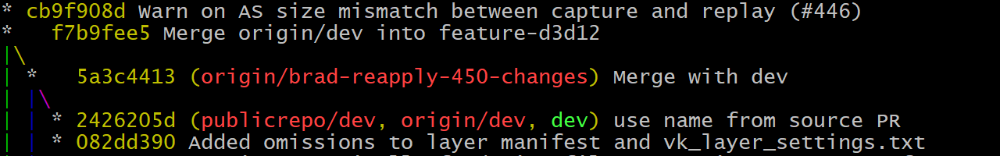
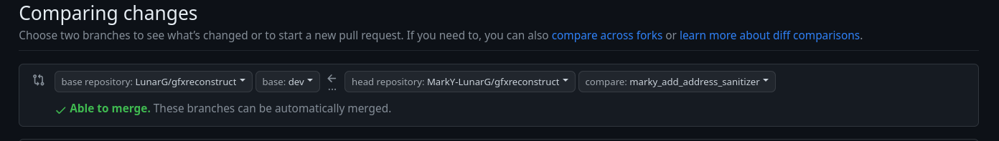
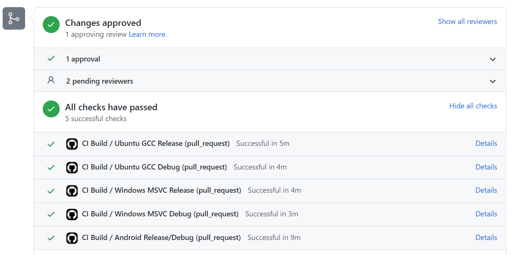
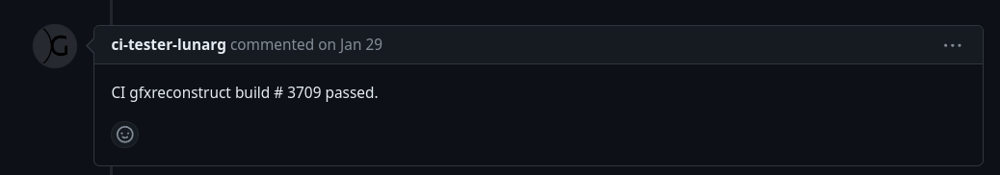

# Contributing to the GFXReconstruct Project

Guidelines for contributing to the GFXReconstruct project.

[![Creative Commons][1]][2]

[1]: https://i.creativecommons.org/l/by-nd/4.0/88x31.png "Creative Commons License"

[2]: https://creativecommons.org/licenses/by-nd/4.0/

Copyright &copy; 2018-2024 LunarG, Inc.

## **Index**

1. [Introduction](#introduction)
1. [License and Copyrights](#license-and-copyrights)
1. [Work In Forks](#work-in-forks)
1. [Creating A Branch For Work](#creating-a-branch-for-work)
    1. [Updating Your Dev Branch](#updating-your-dev-branch)
    1. [Issue Fix](#issue-fix)
    1. [New Feature or Improvement](#new-feature-or-improvement)
    1. [Shared Forks](#shared-forks)
1. [Coding Guidelines](#coding-guidelines)
    1. [GFXR Do's](#gfxr-dos)
    1. [GFXR Don'ts](#gfxr-donts)
    1. [C++ Styling](#c-styling)
    1. [Python Styling](#python-styling)
    1. [Commit Message Format](#commit-message-format)
1. [Testing Changes](#testing-changes)
    1. [Updating Reference Files](#updating-reference-files)
1. [Before Submission](#before-submission)
    1. [Rebase on Dev](#rebase-on-dev)
1. [Submitting Changes](#submitting-changes)
    1. [Contributor License Agreement](#contributor-license-agreement-cla)
1. [Finishing the PR](#finishing-the-pr)
1. [Platform-specific ClangFormat Installation](#platform-specific-clangformat-installation)

<br/>

## **Introduction**

Although the GFXReconstruct project is under active development, external
contributions are always welcome.

Open issues and available tasks can can be found in the project
[issues list](https://github.com/LunarG/gfxreconstruct/issues).

When working on changes that are not already in the issues list, please
consider creating a new issue to avoid duplication of effort, and
feel free to contact any of the project developers should you wish to
coordinate further.

Repository Issue labels:

- _Bug_:          These issues refer to invalid or broken functionality and
  are the highest priority.
- _Enhancement_:  These issues refer to tasks for extending or improving the
  GFXReconstruct software.

If you would like to work on an issue that is already assigned, please coordinate
with the current assignee.

<br/>

## License and Copyrights

All contributions made to the GFXReconstruct repository are LunarG branded and
as such, any new files **must** have the MIT license and copyright included.
Please see an existing file in this repository for an example.

You can include your individual copyright after any existing copyrights.

<br/>

## Work In Forks

For PR development, the GFXReconstruct project does not allow commits
directly into the main repository.

Instead, all developers are expected to create a
[personal fork](https://help.github.com/articles/fork-a-repo/) of the
`LunarG/gfxreconstruct` repo, commit their changes to that repository during
development, and only when the changes are done should a
[pull request](https://github.com/LunarG/gfxreconstruct/pulls) be created
to pull the source into the main repository.

After creating the fork, pull down the source and add the original
`LunarG/gfxreconstruct` repo as a remote with the name `upstream`:

```bash
git remote add upstream git@github.com:LunarG/gfxreconstruct.git
```

Adding this `upstream` remote will allow updating your tree with newer
source from the original repo with ease.

<br/>

## Creating A Branch For Work

GFXR has some guidelines with regards to branch names when performing work.
These guidelines suggest that every branch be named with a clear descriptive
name indicating the purpose of the branch.

Each branch should be based off of the `dev` branch which is where all active
work is eventually submitted to.

### Updating Your Dev Branch

Before creating your branch, it is recommended that you pull down all
recent changes to your fork's `dev` branch from the main repository.

First, make sure you are in your `dev` branch on your local machine

```bash
git checkout dev
```

Next, fetch all the branch info from the server:

```bash
git fetch --all --prune
```

Then you will need to merge in the changes from the `LunarG/gfxreconstruct`
repository (mine remote pointing to that repo is called `upstream`):

```bash
git merge upstream/dev
```

You may have to update submodules as part of this change if the branch
has update `Vulkan-Headers` or some other important repository.
So to be safe, just re-update all submodules:

```bash
git submodule update
```

Then push your changes to your Github fork:

```bash
git push origin dev
```

Now you can freely create your branch

### Branch Naming

Naming your branches a clear name will also help to identify what changes
are present in a branch just by looking at the availabe branches on your
local machine or a remote repo.
Because of this, we suggest naming in the following fashion:

#### Issue Fix

If fixing an issue, create a branch based on the issue number, like `fix-1234`
where `1234` is the issue number in Github.

#### New Feature or Improvement

If adding a new feature or cleaning up existing changes, provide a descriptive
branch name.

If the change fixes a race condition in pipeline submit, it could be named
`fix-pipeline-submit-race-condition`.
Even if the name conflicts with another developer's branch, the branch
resides on your fork and appears to the main Github repo as
`(fork):(branch)`.

#### Shared Forks

If sharing a fork with multiple people (for example all from the same company),
it might be useful to prepend the branch with your user nam.

For example, instead of `fix-1234` one might create a branch `bob-fix-1234`
to differentiate the work from other people working in the repo.

<br/>

## Coding Guidelines

### GFXR Do's

1. Use `GFXRECON_ASSERT` and not `assert`
2. Explicitly compare pointer values against `nullptr`
   For example: `if (pointer_variable == nullptr)`
3. Avoid editing code unrelated to the new functionality or bugfix.

### GFXR Don'ts

1. Don’t hand-edit C++ headers or implementation files in `framework/generated`.
   To change those files, edit the Python generator scripts and run the
   generator as noted in [Rebase on Dev](#rebase-on-dev)


2. Don't perform unnecessary work in your change (like performing additional
   cleanup beyond your change).
3. Do not alter existing capture file block structs or IDs.
   Instead, create new IDs and structs, and deprecate the old blocks so they
   continue to be decoded and consumed.

    * Add a new metacommand to format.h, (e.g. kCreateHardwareBufferCommand2)
    * Change capture to write the new metacommand
    * Rename the old metacommand to ensure developers writing the command are
      notified and add documentation to the file at the deprecated name change.
    * Add code to handle the new metacommand on replay
    * Add a note to replay of the deprecated metacommand if it indicates
      limited or incorrect operation

### C++ Styling

Changes to the GFXReconstruct project's C++ code should conform to the coding
style defined by the
[Google C++ Style Guide](https://google.github.io/styleguide/cppguide.html).

C++ Code formatting is managed with a custom ClangFormat configuration file.
This is the `.clang-format` file found at the base of the repo tree.
It is intended for use with **ClangFormat version 14** (see
[Platform-specific ClangFormat Installation](#platform-specific-clangformat-installation)
for instructions on installing this version for your particular platform)

C++ code formatting can be applied to pending changes with the `clang-format`
or `git clang-format` commands.

Here's an example of the workflow using `clang-format` to clean up formating
issues in code changes:

```bash
# Make changes to the source.

# Add the changes to git's staging area
$ git add -u .

# Run clang-format on the files in the staging area
# any changes will appear in the unstaged portion of git
$ git clang-format-14

# Check for changes applied by clang-format, and if so:
$ git add -u .

$ git commit
```

#### Verifying Changes with the Build Script

For desktop, the Python 3 `scripts\build.py` script can be used to verify changes
before they are committed. By default, the script performs a pre-build step to
verify that the formatting of uncommitted changes adheres to the project's
ClangFormat style.

The build script also has an option to apply `clang-format` to project files
before build. Run the script with the `-h` option for additional usage
information.

### Python Styling

Changes to the GFXReconstruct project's Python code should conform to the
coding style defined by [PEP 8](https://www.python.org/dev/peps/pep-0008/)

Python code formatting may be automatically applied with
[yapf](https://github.com/google/yapf), based on the rules specified in
the repository's .style.yapf file, using the following command:

```bash
# Apply formatting to files in place.
$ yapf -i <files>

# Apply formatting to all python files in this path.
$ yapf -i -r <path>
```

### Commit Message Format

Keep commit message summary (the first line) to 50 characters and format the
remainder of the message to 72-characters.

* This allows the information to display correctly in git/Github logs
* Because a 50-character commit summary [works well](https://cbea.ms/git-commit/)
  with `git log --oneline --graph` on an 80-column window, e.g.:

  

Separate subject from body with a blank line

* Wrap the body at 72 characters
* Capitalize the subject line
* Do not end the subject line with a period
* Use the body to explain what and why vs. how
* Use the imperative mode in the subject line; this just means to write it
  as a command (e.g. `Fix the sprocket`)
* Don't mention any proprietary application titles in the commits

Strive for commits that implement a single or related set of functionality,
using as many commits as is necessary (more is better).
That said, please ensure that the repository compiles and passes tests without
error for each commit in your pull request.

Here's an example of a good commit message:

```
Fix `OverrideAllocateMemory` for trimmed traces

When capturing a replay of a capture and `vkAllocateMemory` is called
with `VkMemoryOpaqueCaptureAddressAllocateInfo` already in the `pNext`
chain, the precedent behavior was to "add" another
VkMemoryOpaqueCaptureAddressAllocateInfo` in front of it.
```

Of course there are always exceptions.
Prefer clarity in the history over pedantically keeping under limits.

<br/>

## Testing Changes

To best test any changes, a variety of applications should be captured and
replayed via GFXReconstruct.
If a new feature (or a broken feature) is known to be resolved by the changes
being submitted, attempt to find or create a sample application that
utilizes it appropriately.

It is recommended to capture and replay one or more Vulkan applications out
of the following repositories:

* VkCube | [Vulkan-Tools Repository](https://github.com/KhronosGroup/Vulkan-Tools)
* One or more samples | [Sascha Willems Vulkan Repository](https://github.com/SaschaWillems/Vulkan)
* One or more samples | [Khronos Vulkan Samples Repostiory](https://github.com/KhronosGroup/Vulkan-Samples)

If you modified one of the other tools, such as `gfxrecon-info`
or `gfxrecon-convert`, make sure to generate the output and compare before
and after snapshots.

Verify your changes on whatever OS/platforms you can.

**NOTE** The automated internal testing will verify on all platforms, but it would be
best for you to do your own verification prior to submitting the changes to reduce
the chance of failed automated testing during PR submission.

<br/>

### Updating Reference Files

If you are making a change that requires updating reference files in https://github.com/LunarG/ci-gfxr-suites,
use the following process:

1. Create a PR in `ci-gfxr-suites` that makes use of the new reference files
1. In the `gfxreconstruct` branch containing your changes, replace the refspec in `TEST_SUITE_REF` with the `HEAD`
   of your `ci-gfxr-suites` change. Note that every time you make a change to your `ci-gfxr-suites` branch, you
   will also need to update the `TEST_SUITE_REF` file in your `gfxreconstruct` branch.
1. Once your gfxr change has been approved and is ready to be merged, ensure that your branch is rebased on top
   of the latest changes in the `dev` branch and passes CI before merging.

## Before Submission

**Do not submit without testing!**

* Run `git clang-format` and commit the changes and push before making the PR.
  (There’s no real danger to the build if you forget; GitHub Actions CI will
  fail on the PR until `clang-format` is applied anyway.)
* Squash unnecessary commits
    * Squash commits that are simple things (i.e. commits like “apply
      clang-format” or “clean up”).
    * Squash pairs of commits that introduce a change and revert the change.
    * Multiple commits within a single PR are encouraged if the PR contains
      multiple sub-functions that make sense to be represented in the Git log.

### Rebase on Dev

Since the `dev` branch may have changed since you started your branch,
prior to submission you should update your fork's `dev` branch
(as mentioned in [Updating Your Dev Branch](#updating-your-dev-branch) above).

Once this is done, rebase your working branch on the updated `dev` branch
and also update submodules just in case:

```bash
git rebase dev
git submodule update
```

If this results in a submodule update and pulls in a new version of the
Vulkan Headers at `external/Vulkan-Headers` or your branch has
touched Python files related to Vulkan code generation, you may need to run the
Python 3 code generator to regenerate some Vulkan component sources.

To regenerate generated source for Vulkan, `cd` to `framework/generated` and run:

```bash
python3 generate_vulkan.py
```

If you are attempting to update support for the DirectX headers or your
branch has touched Python files related to DirectX code generation,
you may need to run the Python 3 code generator to regenerate some Vulkan
component sources.

To regenerate generated source for DirectX 12, `cd` to `framework/generated` and run:

```bash
python3 generate_dx12.py
```

**NOTE** The minimum supported Python version is 3.10.

**NOTE** On some systems, e.g. Windows, the Python 3 executable may be named
just `python`.

<br/>

## Submitting Changes

Changes to the GFXReconstruct project should be made in a branch created off of
the`dev` branch (as mentioned in [Creating a Branch For Work](#creating-a-branch-for-work)).

When creating a [Pull Request](https://help.github.com/articles/using-pull-requests/):

* Make sure that `base repository` is set to the `LunarG/gfxreconstruct` repository
* Make sure the `base` branch is set to `dev`
* Update the `head repository` to point to your fork
* Update `compare` to point to your branch.

It should look something like this:



Also make sure the PR title clearly states the purpose of the issue,
like `Fix crash in vulkaninfo` or
`Add tracking for all types derived from Wrapper`.

* If a PR is submitted in order to share and receive comments and run CI
  before the PR is submitted for final approvals:
    * Add `WIP - ` in front of the title of the PR
    * Mark it as `Draft` in Github

Make sure the description is also clear.

* If it is targeting a specific platform, say which one (`Linux`, `Android`, etc)
* In the case of an issue fix, put the issue number being fixed in the final
  commit message or at least in the PR description so the Github issue and PR
  are linked, and the issue is updated when the PR is merged.
  It has to be a particular phrasing to match the pattern to link the PR with
  the issue, like `fixes #341` or `Fixes #341`; see the Github page on this.

If your change modified something such as `gfxrecon-convert` or `gfxrecon-info`:

* Include a cut-and-paste of output before and after for review.
* Verify that the JSON output validate correctly e.g. through the JSON tool [`jq`](https://stedolan.github.io/jq/)

### Contributor License Agreement (CLA)

The first time you submit to the GFXReconstruct repository, you will be
prompted with a one-time "click-through" CLA dialog as part of submitting your
pull request or other contribution to GitHub.

<br/>

## Finishing the PR

* Did relevant test cases get run by hand against the PR?
    * See [Testing Changes](#testing-changes)
* Did Github Workflows CI pass?
    * This is the "checks passed" or "checks failed" section at the bottom of the PR
    * It represents whether the automated build in a container succeeded.
    * This set of “CI builds” includes no replay of capture files.
      
* Did the extended LunarG CI pass?
    * LunarG runs additional tests on our own machine and posts the results to the PR.
    * This will appear in the `Conversation` part of the PR and appear as comments made.
      
* Have you responded and/or resolved all code-review feedback?

<br/>

## Platform-specific ClangFormat Installation

The following is a collection of notes for obtaining ClangFormat version 14
on various platforms.

### Visual Studio

- Different versions of Visual Studio have different versions of clang-format
  built in. To ensure the best compatibility with GFXR's GitHub checks, version
  14 should be used:
  - Install version 14 of clang-format.exe.
    - clang-format.exe 14 is included when installing LLVM 14
    - The LLVM 14 release download is avialable on the [LLVM 14.0.6 release page on GitHub](https://github.com/llvm/llvm-project/releases/tag/llvmorg-14.0.6)
  - Point Visual Studio to use the custom clang-format.exe:
    - Under **Tools->Options...**, expand **Text Editor > C/C++ > Formatting**.
      At the bottom is a checkbox for **Use custom path to clang-format.exe**.
      Select this, and browse to the location of `clang-format.exe` that was
      installed separately (e.g., `C:\Program Files\LLVM\bin\clang-format.exe`)

### Ubuntu

Currently supported versions of Ubuntu provide clang-format-14 in the package manager.

```bash
sudo apt update
sudo apt-get install clang-format-14 clang-tidy-14
```

For earlier versions of Ubuntu, the required version of `clang-format` can be
obtained through the [LLVM toolchain repository](https://apt.llvm.org).

Configure `clang-format` and `clang-tidy` so that the new version is used by default:

```bash
sudo update-alternatives --install /usr/bin/clang-format clang-format /usr/bin/clang-format-14 900
sudo update-alternatives --install /usr/bin/clang-tidy clang-tidy /usr/bin/clang-tidy-14 900
```
