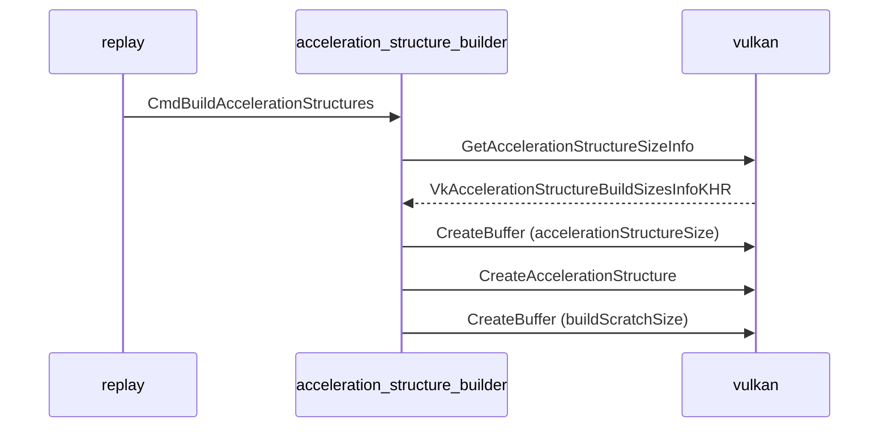
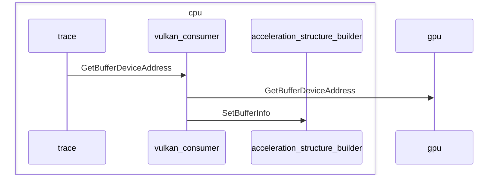
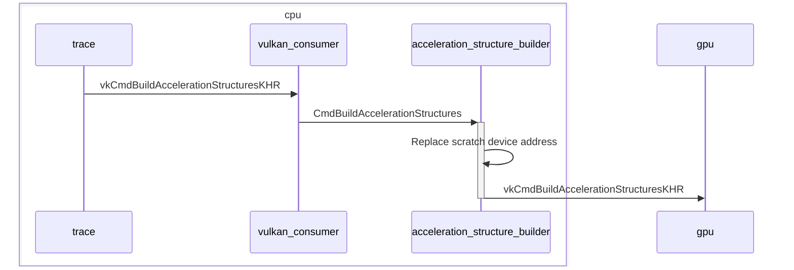
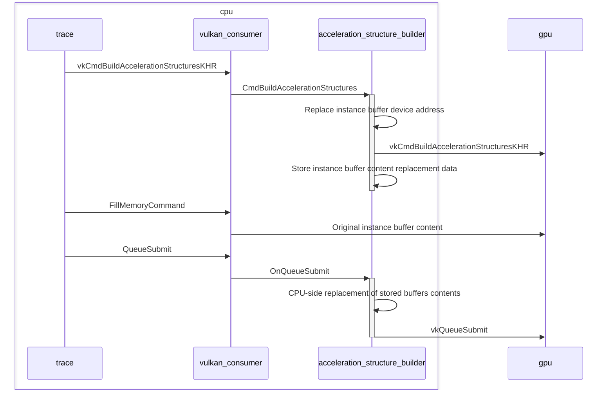
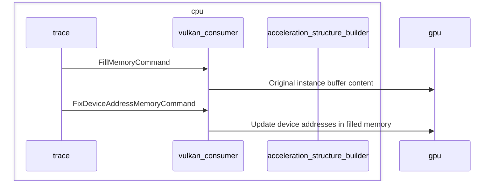
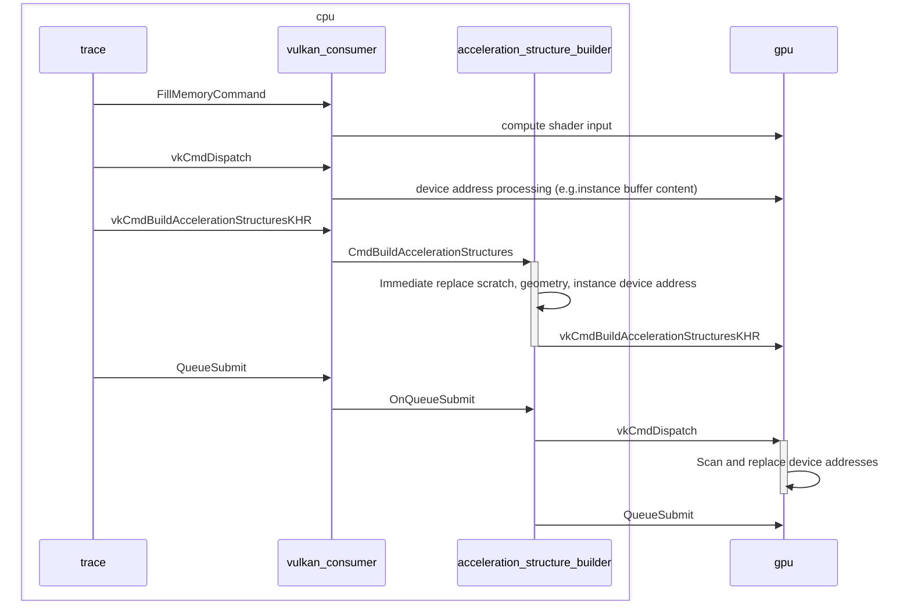

# Replay
## Problem
Acceleration structures have specific memory requirements for the buffers they use.
Also, commands operating on acceleration structures will refer to buffers by device addresses rather than handles.
These requirements and addresses are typically queried by the captured app and used as parameters later on.
Commands containing such parameters can fail to replay on different platforms due to differences in required sizes and alignments.
Current solution for handling device addresses using DEVICE_ADDRESS_CAPTURE_REPLAY does not guarantee portability.

## Proposed solution

[VulkanAccelerationStructureBuilder::CmdBuildAccelerationStructures](https://github.com/bartosz-muszarski-arm/gfxreconstruct/blob/7b19997f14602ad8944868c1a13aac5aeb94b5f0/framework/decode/vulkan_acceleration_structure_builder.cpp#L598)



### Device address
Device addresses can be replaced at runtime with correct values in expected calls.
The proposal is based on mapping the captured device address to a buffer and retrieving the device address of that buffer at runtime.
Addresses with offsets can be handled as well by searching based on known buffer addresses and sizes, then applying the same offset to found address.
Buffers containing device addresses can be written to at any time, so for device operations - AS build commands specifically - the address replacement is delayed until the command buffer containing such commands is queued for execution.

#### Register used device addresses
All device addresses used in the trace had to be fetched via vkGetBufferDeviceAddress command.
That assumption should be considered in trimming, where this call could be skipped. 


#### Replace device addresses
Device addresses can be used in api calls directly, like scratchData in vkCmdBuildAccelerationStructuresKHR, or have levels of indirection, like instances data in VkAccelerationStructureGeometryInstancesDataKHR. Lastly, they can be passed to compute shaders and processed on gpu.
##### Immediate replacement
In the simplest case device addresses can be replaced immediately in call override:

##### Delayed replacement
In the second case, if the device address was put inside a buffer, additionally to the immediate replacement the content of the buffer has to be replaced as well, like instances data in VkAccelerationStructureGeometryInstancesDataKHR.
The problem is the content of the buffer can be filled at any time.
In the proposed solution the buffers content is replaced right before QueueSubmit:

##### Capture-Assisted replacement
In general, device addresses may end up in buffers passed to compute shaders for processing.
There are cases where compute shaders read buffer content based on device address, or fill out the instance buffers for acceleration structure build commands.
In this scenario finding the memory containing device address for replacement becomes a challange.
Proposed solution is to scan content of FillMemoryCommand on capture. If a known device address is found, "FixDeviceAddressMemoryCommand" metacommand is injected, informing the replayer on the locations of device addresses within a buffer.



##### GPU-based solution
Alternative solution to capture-assisted approach is to replace device addresses during replay on the GPU.
A compute shader would scan provided areas of memory for known device addresses and replace them right before QueueSubmit.
This helps with situations where the instance buffers are filled by a compute shader in the same submission as the acceleration structure build command:




### Buffer sizes
Use similar approach to rebind allocator.
Once AS build command is queued for execution:

1. Query for correct buffer sizes

2. Create new acceleration structure and necessary buffers with correct sizes using rebind allocator

3. Replace parameters in the build command with the addresses of new buffers and the destination AS 

Any reference to the acceleration structures built originally - handles and device addresses -  needs to be replaced.

#### Known issues
It's not always possible to replace addresses properly. Device addresses can be set with MapMemory/FillMemoryCommand and used in shaders.
WIP: scan buffers used in shaders for known device addresses at capture time, insert metacommand signaling the replay to update device address at found location at runtime.

# Trimming

## Problem
Currently acceleration structures are saved to memory by state tracker and restored on replay.
This approach does not guarantee portability, as the deserialized acceleration structure may be incompatible with the replay device.

## Proposed solution
Acceleration structures can be recreated using the most recent build/copy/update commands.
Since these commands require handling on the replay side anyway to account for different sizes and alignment, this would be better handled by separate metacommands:
```
kVulkanBuildAccelerationStructuresCommand = 28,
kVulkanCopyAccelerationStructuresCommand  = 29
```

These metacommands contain data necessary to build/copy acceleration structures and are consumed by Acceleration structure builder on replay:
```
void VulkanAccelerationStructureBuilder::ProcessBuildVulkanAccelerationStructuresMetaCommand(
   uint32_t                                                      info_count,
   VkAccelerationStructureBuildGeometryInfoKHR*                  geometry_infos,
   VkAccelerationStructureBuildRangeInfoKHR**                    range_infos,
   std::vector<std::vector<VkAccelerationStructureInstanceKHR>>& instance_buffers_data)

void VulkanAccelerationStructureBuilder::ProcessCopyVulkanAccelerationStructuresMetaCommand(
   uint32_t info_count, VkCopyAccelerationStructureInfoKHR* copy_infos)

```
### Known issues
#### Portable/original trimming switch
Additional capture option is introduced:
experimental_raytracing_fastforwarding
Allowing to switch between the original trimming strategy and the proposed approach.

#### Capturing internal calls
As the functionalities required for portable replay use vulkan api as well, they're captured while trimming.
A redundant set of calls will be traced and consumed in the replayer, creating performance and memory overhead.
```
TODO: expose an api from the replayer to the capture layer signaling internal handling.
```
