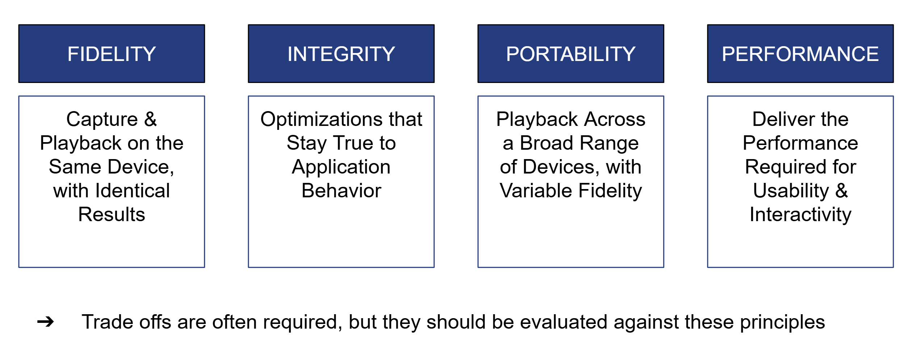

# GFXReconstruct Architectural Principles

<!-- ─────────────────────────────
     Table of Contents
     ───────────────────────────── -->
- [Purpose](#purpose)
- [Use Cases](#use-cases)
  - [Reproduction](#reproduction)
  - [Tooling](#tooling)
  - [Silicon](#silicon)
- [Architectural Principles](#architectural-principles)
  - [Best Effort](#best-effort)
  - [Reconstruct](#reconstruct)
  - [Preserve](#preserve)
  - [Replay](#replay)
  - [Workload](#workload)
  - [Reproduce](#reproduce)
  - [Performance](#performance)
  - [Dependency](#dependency)
- [Backward Compatibility (major revision)](#backward-compatibility-within-a-major-revision)
  - [Format](#format)
  - [Interface](#interface)
  - [Compatibility](#compatibility)
  - [Invocation](#invocation)
  - [Convert-JSON](#convert-json)

---

# Purpose

The purpose of GFXReconstruct is recording application graphics API calls to a file (hereafter called a “capture file”), replaying the API calls from a capture file, and processing capture files.  The design, implementation, and use of the tools should be simple. The capture file content should preserve the application’s calls thoroughly and accurately.  Replay should by default attempt to honor the application’s intent.

We recognize broad categories of use for GFXReconstruct that we describe below.  The definition of these “use cases” guides the definition of the principles.

# Use Cases

## USE-CASE-REPRODUCTION

GFXReconstruct is intended primarily for reproduction of an application’s API calls for analysis, bug reporting, and testing.  This use case prioritizes the integrity and fidelity of the captured data and reproduction of the data when replayed.  While file storage and performance is valued, representing the application’s original API calls and intent when possible is paramount.  This use case prioritizes using GFXR through one or more of its command-line tools or scripts and does not prioritize use of the internal classes or objects within the code itself.

## USE-CASE-TOOLING

GFXReconstruct is also valuable as a foundation for other tools that capture, process, and replay API calls.  For this use case, tools using GFXReconstruct may opt in to relax the constraints on integrity and fidelity described in USE-CASE-REPRODUCTION and may select to modify the API call sequence to support capture and replay performance and responsiveness.  This case raises the priority of the use of GFXReconstruct through its class structure and exposes some implementation details.

## USE-CASE-SILICON

A refinement of USE-CASE-REPRODUCTION is helpful for the purpose of development of new products.  Replaying captured content on pre-production and hardware under development can help to evaluate functional completeness of hardwares and drivers prior to production. That development may require operation in environments with limited resources like low RAM, low or no local storage, and potentially transformations on the API call stream to support testing new features or the elimination of legacy features.

# Architectural Principles 

## BESTEFFORT

**Developers should apply their best effort to adhere to the spirit of the principles**

If an exception is made to a principle, there should be a well-considered, documented reason.  These principles are listed in rough order of decreasing importance so that a reasoned decision can be made if new development would necessarily conflict with one or the other of two principles.

## RECONSTRUCT 

**A capture file should contain as much as possible all of the unmodified graphics API calls made by the application for the captured, trimmed range of frames.**

It may contain more commands represented by Metadata commands but it should be possible to **reconstruct** the original app’s sequence of API commands from the captured “api call” blocks.

* Implications:  
  * With no options enabled, capture should record as much as possible a “vanilla” capture that does not record additional graphics API calls.  Graphics calls to retrieve additional information should be represented as metadata command blocks (e.g. existing FillMemoryCommandHeader “MetaData Command”) so that it is differentiated from the app’s calls. Graphics calls that must be modified to enable replay should be represented as or augmented with metadata command blocks (e.g. SetOpaqueAddressCommand).  
* Benefits:  
  * It is possible to analyze an application’s API calls using the content of the capture file without the application.   The user doesn’t have to determine what calls the capture layer modified or added.  
* Exceptions:  
  * Because of the nature of trimming, Graphics API calls issued before the beginning of the trim range are likely to be rearranged and many omitted.  The individual calls to create objects and change object state should remain as close to the original commands issued by the application as possible.  

## PRESERVE 

**The graphics API calls made by the application during capture should be passed to the implementation (or downchain when layering) with as little modification as is possible.**

Capture should avoid changing the content of the application’s graphics commands.  Some exceptions are necessary in order to save information required for replay or modify data so that replay is possible.

* Implications:  
  * It *may* be acceptable for the user (through capture layer configuration from, as examples, environment variables, Android properties, or calls into the capture layer from another API layer or the application being captured) to *request* an annotated or altered capture.  (e.g. A user may wish to save the GPU buffers used by drawing commands at capture time.  However, the preferred technique for altering the application’s graphics command stream and saving additional information for a specialization of GFXR is to make an additional upchain or downchain layer separate from GFXR. For APIs without a formal third-party layering procedure (e.g. DirectX 12), we may implement a plugin architecture for pre- or post- function and method call alteration of commands.)
  * Combined with the above principle “A capture file should contain as much as possible of all the graphics API calls made by the application”, a corollary is that API calls modified in capture should be stored in their original form in the capture file; a MetaData Command may encode additional information to signal to the replay application to also modify the calls on replay.  
* Benefits:  
  * GFXR limits the differences between running the application with and without the capture layer.  GFXR increases confidence that replay of the capture file will closely match the application’s execution without the capture layer.  
* Exceptions:  
  * Capture enables the Vulkan device features bufferDeviceAddressCaptureReplay, rayTracingPipelineShaderGroupHandleCaptureReplay, and accelerationStructureCaptureReplay during capture of Vulkan applications (and in replay) to allow replay on the same device and driver of ray-tracing workloads.  
    * Capture may alter function calls (e.g. add USAGE flags to memory creation) that enable the use of those device features  
  * Before a trim range and, in particular, immediately before the first function within a trim range:  
    * GFXReconstruct may make API calls to query state, read memory contents, and synchronize with the underlying implementation.  
    * GFXReconstruct may remove some functions that pertained only to previous frame contents that are not included in the trim range.  An example is if vkQueuePresentKHR was omitted from state setup, then vkWaitForFences  
  * Additionally, any changes in the future that may alter original application behavior should be configurable with a capture-time option. 

## REPLAY 

**Replay without user intervention in the **same** **environment** as capture is an explicit goal. **

Replay on the same GPU model as capture, on the same operating system, with the same driver revision, under the same or lower load conditions without additional user-provided options **is** an explicit goal.  

Replay on GPUs, operating systems, OS revisions, and driver revisions that differ from the capture environment, while a lower priority than replay on the same environment, is highly desired.  Therefore capture must not make portable replay impossible.

* Implications:  
  * Include modifications to the sequence of commands without which replay *in the same environment* would be unlikely to succeed.  An example is “Virtual Swapchain”, without which swapchain image indices are likely to differ between capture and replay for all presentation modes except FIFO.  
* Benefits:  
  * Users are not surprised by “replay” failing for a capture just taken.  
* Exceptions:  
  * Android replay may require “--surface-index” parameter app to force selection of a particular surface.

## GPU WORKLOAD 

**Replay should result in a GPU workload as similar to capture as possible unless requested by the user.**

Shaders, resources, dependencies, memory access patterns, etc within the trim range should be as similar as possible to that which resulted from capture and without GFXReconstruct, unless requested by the user.  Exceptions include requirements for replay in the same environment as capture, e.g. Virtual Swapchain for swapchain image index determinism.

* Implications:  
  * Avoid additional Draw calls.  
  * Avoid introduced synchronization.  
* Benefits:  
  * It is possible to analyze the utilization of the GPU by the application after the fact.  
* Current Exceptions:  
  * Virtual Swapchain  
  * Replay is currently single-threaded; memory and object creation and access sequences may differ from the captured workload

## REPRODUCE 

**Replayed command sequence should be as close to the captured command sequence as possible.**

The replayed commands and methods should be as close to the sequence that was captured as possible except in cases in which changes are necessary (e.g. Virtual Swapchain) unless requested by the user.

* Implications:  
  * For commands issued from a single thread within a trim range, the replayed sequence should be as close to identical as possible to the captured sequence except for prominently identified examples (e.g. DXR commands)  
  * For commands issued from multiple threads during capture, the sequence order is guaranteed not to differ at well defined synchronization points.  
  * For trimmed sequences, no order is guaranteed for the commands to create objects and set state.  
  * For trimmed sequences, GPU memory and graphics API state in replay at the beginning of the sequence are, as much as possible, the same as they would be if previous commands had not been trimmed.  
* Benefits:  
  * Execution of code inside the graphics implementation is repeatable and closer to the code executed during capture, so analysis of the replayed commands applies to the application’s commands  
* Current Exceptions:  
  * Virtual Swapchain  
  * Replay is currently single-threaded; memory and object creation and access sequences may differ from the captured workload

## PERFORMANCE 

**All components but especially capture should be designed and implemented with an eye to reducing the impact on system performance.**

We accept that the capture layer will reduce system performance and increase use of system memory during capture of the application.  All components should be designed and implemented with an eye to performance, especially the capture layer.

* Implications:  
  * Avoid locks and allocations  
  * Make large initial allocations, avoid repeated allocations  
  * Prefer grouping gpu-transfer operations, limit added queue submissions and synchronization (try to limit stalls when initiating trimmed capture)  
* Benefits:  
  * Ease of use of the tools  
* Current Exceptions  
  * We may have lots of STL maps doing small incremental heap allocations of their internal redblack tree nodes protected by locks (grep for std::map).  
  * We have plenty of std::vectors in local variables which may make multiple heap allocations and frees on every execution of their surrounding blocks of code (depending on optimization level?)

## DEPENDENCY 

**Capture layer should not shell out / fork/exec / CreateProcess except whenever absolutely necessary**

Capture and replay run on three different operating systems and the intersection of similar system tools that are installed by default is small. Expecting any system binaries other than the default will be awkward.  Installing additional tools may be possible but we install the capture layer and gfxrecon-replay on demand on Android, and installing additional tools would add complexity.

* Benefits:  
  * Reduce external dependencies

# Backward Compatibility Within A Major Revision 

## FORMAT 

**Existing binary capture files will continue to be readable.**

Existing block types and commands will continue to exist in format.h and the FileProcessor and Decoder will continue to read and decode those blocks.  Blocks may be deprecated for writing to a file, which means adding "\_deprecated" to their enumerant and struct name and noting the new ID and block struct to use.  (We've already done this for "kCreateHardwareBufferCommand\_deprecated".  Note there exist kResizeWindowCommand and kResizeWindowCommand2 but the "2" denotes an extended command, not a replacement command.)

## INTERFACE 

**Some object methods and function call signatures will be frozen.**

A subset of the existing Consumer interface methods, utility library functions, namespaces, and global constants will continue with their current signatures.  This allows others to subclass from the Consumer base classes and also call Consumers using the Consumer base class interfaces.  Compatibility is currently limited to source code (eliminate or reduce compile time errors) but not binary compatibility.

Existing method signatures should not be removed or altered for the base classes for VulkanConsumer, Dx12Consumer, MetadataConsumerBase, MarkerConsumerBase as of [v1.0.4](https://github.com/LunarG/gfxreconstruct/tree/v1.0.4).

Existing function signatures should not be removed or altered for functions in “framework/util”:

* date\_time.h  
* defines.h  
* driver\_info.h  
* file\_output\_stream.h  
* file\_path.h  
* gpu\_va\_map.h  
* gpu\_va\_range.h  
* hash.h  
* json\_util.h  
* keyboard.h  
* logging.h  
* memory\_output\_stream.h  
* monotonic\_allocator.h  
* output\_stream.h  
* platform.h  
* strings.h  
* to\_string.h

Changes to functionality will be managed (in decreasing order of preference) by (A) versioning the class (e.g. “VulkanConsumer2”), or (B) versioning the method/function (e.g. “Dx12ConsumerBase::Process\_DriverInfo2”).

## COMPATIBILITY

**Default behavior should persist if possible**

The default behavior of tools and capture layers should not change. 

## INVOCATION 

**Existing environment variables and command line options will not be deleted.**

Existing environment variables and properties for capture as well as command line arguments to replay shall continue to work as implemented or be disabled with a non-fatal message so that scripts would not unexpectedly break.

## CONVERT-JSON 

**Avoid changing JSON key names and value types.**

The implicit schema (or possibly we need to create an explicit schema) of the JSON and JSONLines output of convert will not be changed except for deprecation of command IDs.  New field names may be created.

* Vulkan output as of version 1.0.4  
* Direct3D 12 output at version 1.0.4

