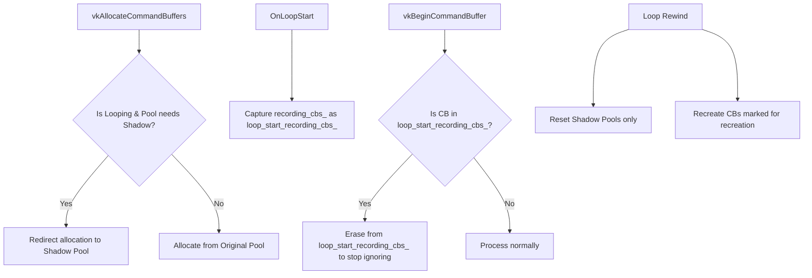

# Command Buffer Handling during Frame Looping

During frame looping, GFXReconstruct replays a specific range of frames (from `loop_start_frame` to `loop_end_frame`) repeatedly. This document describes how Vulkan command buffers (CBs) are managed across loop iterations.

## The Problem

Vulkan command buffers can be classified into two categories based on their lifetime relative to the loop boundary:

1.  **Loop-Internal CBs**: These command buffers are fully contained within the loop. Their lifecycle is:
    `vkBeginCommandBuffer` -> `vkCmd...` -> `vkEndCommandBuffer` -> `vkQueueSubmit` (all occurring inside the loop).
    Replaying these is straightforward: every loop iteration naturally replays the entire sequence, re-recording and submitting the CB. However, we must reset the command pools at the loop boundary to prevent memory leaks from accumulating allocations.

2.  **Boundary-Spanning CBs**: These command buffers are begun *before* the loop start (in the setup phase), but have commands recorded, are ended, or are submitted *inside* the loop.
    *   **Iteration 1**: Replays normally (since setup occurred).
    *   **Iteration 2+**: Since the setup phase is skipped, `vkBeginCommandBuffer` is **not** replayed. However, any `vkCmd...` or `vkEndCommandBuffer` calls that occurred inside the loop range **are** replayed.
    *   If we reset the command pool of a boundary-spanning CB at the loop boundary, it is reset to the initial state, wiping any commands recorded before the loop. Replaying `vkCmd...` on it without `vkBeginCommandBuffer` causes Vulkan validation errors or crashes. If we ignore the commands, it is submitted empty.

---

## Implemented Hybrid Solution

To support all gaming workloads (including Dynamic Rendering and Compute-heavy workloads) without memory leaks or rendering regressions, GFXReconstruct implements a hybrid strategy combining **Shadow Command Pools** and **Explicit Classification with Selective Recreation**.

### 1. Shadow Command Pools (For Loop-Internal Allocations)

To prevent memory leaks from loop-internal allocations without wiping the boundary-spanning command buffers, we segregate allocations using shadow pools:

*   **Detection**: At `OnLoopStart`, identify all command pools containing boundary-spanning command buffers (i.e., command buffers in the `recording_cbs_` set at the loop boundary) and mark them as requiring shadowing.
*   **Lazy Shadow Pool Creation**: If the replayer intercepts `vkAllocateCommandBuffers` *inside* the frame loop targeting a pool requiring shadowing, it lazily creates a corresponding "shadow" command pool.
*   **Allocation Redirection**: Redirect the allocation call to the shadow pool. All command buffers allocated inside the loop from this pool are marked as redirected.
*   **Selective Pool Reset**: At the loop boundary (on every loop iteration), call `vkResetCommandPool` only on the **shadow pools** (wiping the loop-internal command buffers). The original pools (containing boundary-spanning command buffers) are **not** reset, preserving their pre-recorded commands.

### 2. Explicit Classification & Selective Recreation (For Boundary-Spanning CBs)

For command buffers allocated *before* the loop (in the original pools), we classify them at the loop boundary based on whether the game re-records them inside the loop:

*   **Case A: True Cross-Boundary CBs (Preserved)**
    *   *Definition*: Command buffers that are open at loop start, ended/submitted inside the loop, but **never** re-begun (no `vkBeginCommandBuffer` is called on them inside the loop).
    *   *Handling*: We keep them in `loop_start_recording_cbs_`. On Iteration 2+, we **ignore** all recording commands on them (`vkCmd...`, `vkEndCommandBuffer`) using `ShouldIgnoreRecordingCommand`. Since their original pool is not reset, they retain their pre-recorded commands and can be submitted normally on every iteration.

*   **Case B: Re-recorded Boundary-Spanning CBs (Recreated)**
    *   *Definition*: Command buffers that are open at loop start, but the game calls `vkBeginCommandBuffer` on them inside the loop to reset and re-record them.
    *   *Handling*: When `vkBeginCommandBuffer` is called on a loop-start recording CB, we **erase** it from `loop_start_recording_cbs_` so we do not ignore its recording commands. At loop rewind, since the original pool is not reset, we **synthetically recreate and re-begin** it to reset its state to `INITIAL` (executable).

---

## Workload Case Studies

### 1. Loop-Internal Allocations (e.g., Dynamic Rendering)
*   **Workload Pattern**: Allocates and records many command buffers inside the frame loop (common in modern render pipelines utilizing dynamic rendering).
*   **Handling**: These are classified as loop-internal. They are redirected to shadow pools and wiped on every iteration at the loop boundary, preventing memory leaks.

### 2. Pre-recorded Secondary Command Buffers
*   **Workload Pattern**: A secondary command buffer containing pre-recorded draw calls (recorded during the setup phase) is ended and executed inside the loop.
*   **Handling**: Classified as a *True Cross-Boundary CB*. It is not recreated, and its recording commands are ignored. The original pool is not reset, preserving its draw calls across all loop iterations.

### 3. Re-recorded Boundary-Spanning Command Buffers
*   **Workload Pattern**: A command buffer is open at loop start, ended, and then re-begun/re-recorded in the middle of the frame loop.
*   **Handling**: Classified as a *Re-recorded Boundary-Spanning CB*. It is erased from `loop_start_recording_cbs_` upon `vkBeginCommandBuffer`, and recreated/re-begun on loop rewind so it starts subsequent iterations in a clean state to receive new recording commands.
