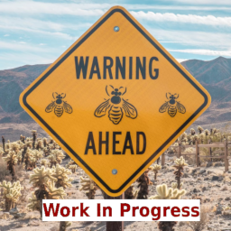

<p align="center">
  
</p>

#  GFXReconstruct ToCpp Tool

## Overview

The ToCpp tool converts the GFXReconstruct capture file into a cpp source with
Vulkan API calls.
This allows easier modification of content in a trace without compromising
the original traces integrity.

**NOTE:** This tool is released in an **Alpha** state and has many limitations.
These limitations are discussed below.

## Known Current Issues

Because the ToCpp tool is still not in a complete state, it has the following
known issues which will be worked on over time:

* The generated cpp code does not handle a window/swapchain resize
* The generated cpp code only executes on either Android or Linux (XCB)
* It does not currently support Ray Tracing contents in a capture
* The generated cpp code expects a system exactly like the capture system:
  * Same number of physical devices
  * The same physical device (think Nvidia GTX 3060) at the same offset in the
    list
  * Part of this would be resolved when memory rebinding is implemented in this
    tool.
  * NOTE: The best way to resolve this in the meantime is to restrict the loader
    to revealing only one ICD during capture and replay on any given target.
* Large traces can lead to stack exhaustion during a compilation
  * This is especially true on Android
  * For my Linux system, the average max trace supported before compiler errors
    start to cause a problem is around 2000 frames.  But this varies per
    application capture.

## Usage

### Prerequisites

* Build GFXReconstruct (including the ToCpp tool)
  * This is done by setting **-DGFXRECON_TOCPP_SUPPORT=ON** during the CMake build
    file generation process.
  * This will generate the `gfxrecon-tocpp` executable in the
    `<build-folder>/tools/tocpp`` directory.

### Command Line
```sh
gfxrecon-tocpp <command-line-args> <capture-file>
```

### Valid Command-Line Arguments

| Command-line Argument              |   Type                  | Description                                             |
| :--------------------------------- | :---------------------: | :------------------------------------------------------ |
| -a <br> --android-template <dir>   | Required (Android Only) | Directory path containing the Android application template files. (Only valid for Android platform target) |
| -c <br> command-limit              | Optional                | Maximum number of API commands recorded per C++ file. The intent is to adjust compilation load per file. (Defaults to 1000 commands per file) |
| -d <br> --max-window-dimensions    | Optional                | Maximum dimensions of the created window. (For example '-d \<width\>,\<height\>') |
| -f <br> --frame-limit              | Optional                | Maximum number of frames to convert to C++ code from the capture file. |
| -h <br> --help                     | Optional                | Print Usage information and exit.                       |
| -o <br> --output <dir>             | Required                | Directory path where the output will be generated into. |
| -s --captured-swapchain            | Optional                | Use the swapchain as it was captured during toCpp replay instead of using the "Virtual Swapchain" path. |
| -t <br> --target <platform>        | Optional                | Type of target platform to generate the Vulkan source.<br>Available Platforms: android, xcb |
| -v <br> --version                  | Optional                | Print version information and exit.                     |

## Generate Source From a Capture

### Android

```sh
# In the root of GFXReconstruct
./build/tools/tocpp/gfxrecon-tocpp -t android -o out_android \
      --android-template external/Tocpp-Android-Template/ ./android_capture.gfxr
```

* `-t android` `(--target android)` indicates that we generate for Android.
* `-o out_android` `(--output out_android)` specify the directory where all the
  required files will be copied/generated.
* `--android-template external/Tocpp-Android-Template/` specify where is the
  Android template.

At the end in the output directory (`out_android`) all files from the template
directory (specified by `--android-template`), the generated
`app/src/main/jni/VulkanMain.cpp` and the saved image data
(`app/src/main/assets/*.bin`) can be found.

#### Build the APK

##### Prerequisites
* [Gradle](https://gradle.org/install/)
* Android NDK
    * [NDK](https://developer.android.com/ndk/downloads/index.html)
    * SDK with the latest cmake package

**OR**

* [Android Studio 3.0](https://developer.android.com/studio/index.html) or
  higher

Create the APK:

```sh
# Inside the output directory (`out_android`)
gradle assembleDebug
```

#### Install the APK

##### Prerequisites
* A device running Android 7.0 (API level 24) or higher
* The program `adb` if we want to install it outside of the Android Studio.

```sh
# Inside the output directory (`out_android`)
adb install ./app/build/outputs/apk/debug/app-debug.apk
```

---

### Linux (XCB)

```sh
# In the root of GFXReconstruct
# Where 'build' in this case is the build folder used to generate the source
./build/tools/tocpp/gfxrecon-tocpp -t xcb -o out_xcb_capture ./capture.gfxr
```

* `-t xcb` indicates that we generate for XCB platform.
* `-o out_xcb_capture` specify the directory where the generated files will be
   placed.

At the end the output directory (`out_xcb_capture`) contains the generated
`capture.cpp` and the saved image data (`*.bin`).

### Build the source for desktop (XCB)

```sh
#cd <output directory>
cd  out_xcb_capture

# Generate build contents
cmake -H. -Bbuild

# Perform the build
cmake --build build
```

### Run the source for desktop (XCB)

```sh
# Inside the output directory (`out_xcb_capture`)
./build/vulkan_app
```

## Make Capture Conversion Easier

Currently, there is no memory re-binding or swapchain improvement code in the
`ToCpp` path.
Despite this restriction, it is possible to re-capture existing traces to make
them convert to C++ code more easily and correctly for the target system.
The secret to do this is to capture a replay of the original capture using the
`gfxrecon-replay` tool and have that tool modify the necessary items to work
better on the system.
This new capture will therefore be more friendly with the target system.
In addition, due to the number of frame limitations, it is also possible to
capture fewer frames for generating the source from.

For example:

```
python3 ./x86_64/bin/gfxrecon-capture-vulkan.py -o new_capture.gfxr -f 1-1000 \
        --no-file-timestamp gfxrecon-replay --remove-unsupported -m rebind    \
        --wsi xcb original_capture.gfxr
```

This replays an existing capture on Linux using XCB as the WSI interface,
rebinds the memory, and removes unsupported extensions for the current platform.
The capture not only creates a new capture file, but trims the original capture
file down to only 1000 frames so that it is easier to generate compilable C++
source code.